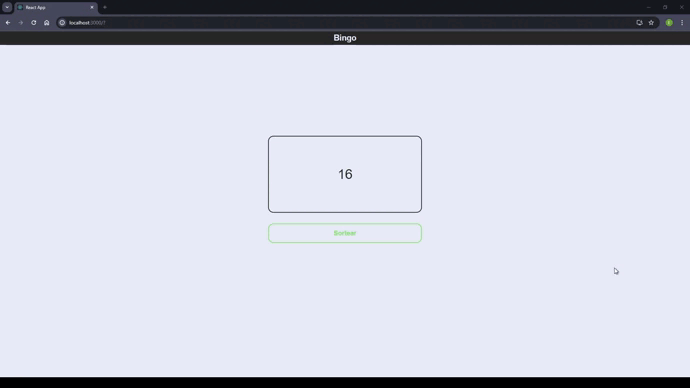

<h1 align="center">
    
</h1>

## 🚀 Tecnologias utilizadas

O projeto foi desenvolvido utilizando as seguintes tecnologias

- [ReactJS](https://reactjs.org)
- [Styled Components](https://styled-components.com/)

---

## 🗂 Como baixar o projeto

```bash

    # Clonar o repositório
    $ git clone https://github.com/eduardopvieira16/bingo-react

    # Entrar no diretório
    $ cd bingo-react

    # Instalar as dependências
    $ yarn install

    # Iniciar o projeto
    $ yarn start
```

---

Desenvolvido 💜 por Eduardo Vieira
