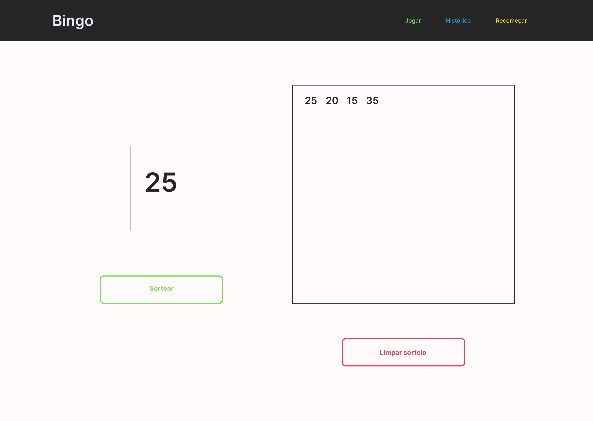

## Ainda em criação ##

Erro na rota. React Router Dom atualizado

<h1 align="center">Bingo</h1>

  <a href="#dart-about">About</a> &#xa0; | &#xa0;
  <a href="#rocket-technologies">Technologies</a> &#xa0; | &#xa0;
  <a href="#white_check_mark-requirements">Requirements</a> &#xa0; | &#xa0;
  <a href="#memo-license">License</a> &#xa0; | &#xa0;
  <a href="https://github.com/eduardopvieira16" target="_blank">Author</a>

 

## :dart: About ##

Bingo é um projeto do famoso jogo de bingo, até porque o nome da diz rsrs... Esse projeto tem o intuito em trabalhar a lógica e depois de concluído, poder se divertir com a família

Home:

## :rocket: Technologies ##

The following tools were used in this project:

- [React](https://pt-br.reactjs.org/)
- [TypeScript](https://www.typescriptlang.org/)
- [Styled Components](https://styled-components.com)

## :white_check_mark: Requirements ##

Before starting :checkered_flag:, you need to have [Git](https://git-scm.com) and [Node](https://nodejs.org/en/) installed.

## :memo: License ##

This project is under license from MIT. For more details, see the [LICENSE](LICENSE.md) file.

Made with :heart: by <a href="https://github.com/eduardopvieira16" target="_blank">Eduardo Vieira</a>

&#xa0;

<a href="#top">Back to top</a>
